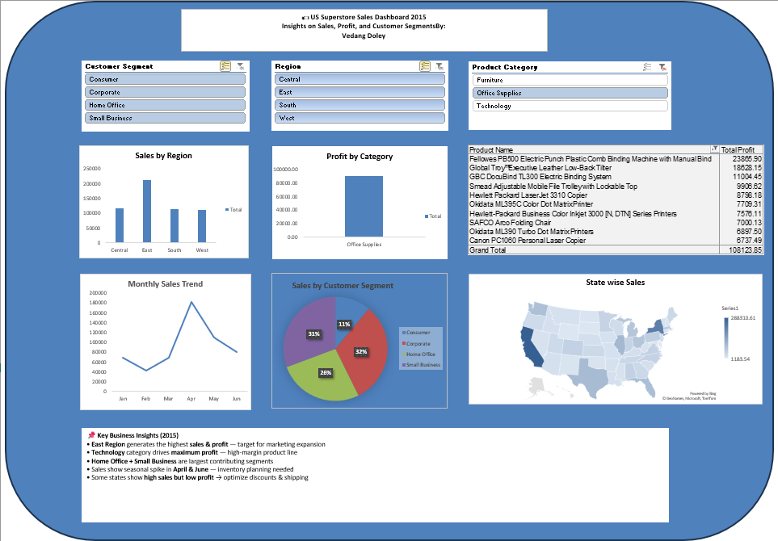

# US Superstore Sales Dashboard – 2015

📊 An interactive Excel dashboard analyzing the US Superstore dataset for 2015.  
Designed to uncover key business insights on sales trends, product categories, regions, and customer segments.

---

## 🔍 Key Features
✔ Fully interactive using Slicers  
✔ Region-wise and State-wise Sales Analysis  
✔ Product Category Profitability  
✔ Customer Segment Distribution  
✔ Monthly Sales Trend  
✔ Top 10 Profitable Products  
✔ Clear business insights for decision-making  

---

## 📌 Tools & Techniques Used
- Microsoft Excel
- Pivot Tables
- Pivot Charts
- Slicers & Filters
- Data Cleaning
- Visualization Formatting

---

## 🧠 Business Insights
- **East Region** generates highest **sales & profit**
- **Technology** is the most profitable **product category**
- **Home Office + Small Business** segments are strong contributors
- Sales peak in **April & June** → seasonal demand pattern
- Several states show high sales but **lower profit margins** → pricing & shipping strategy needed

---

## 📷 Dashboard Preview

---

## 📎 Dataset Source
Superstore Sales (US, 2015)

---

## 👨‍💻 Author
**Vedang Doley**  
Data Science & Analytics Enthusiast  
📍 India  
🔗 LinkedIn profile: *https://www.linkedin.com/in/vedang-doley-5a7b4b265/*  
